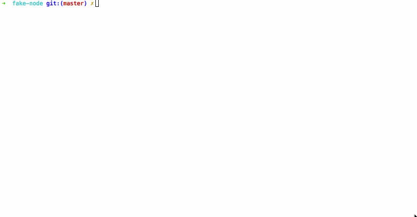
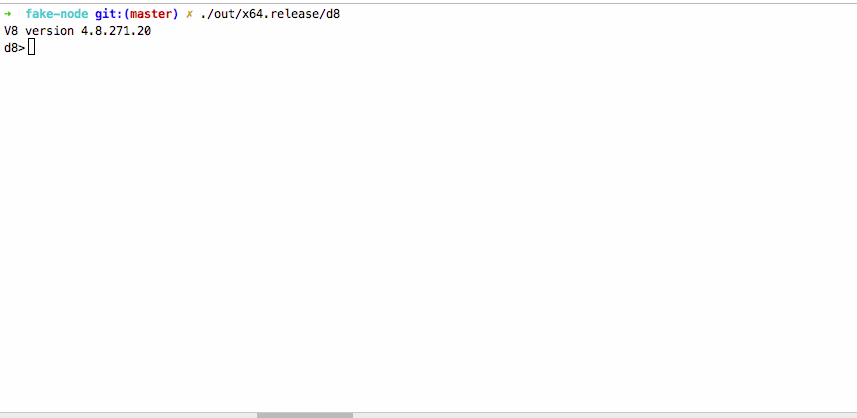
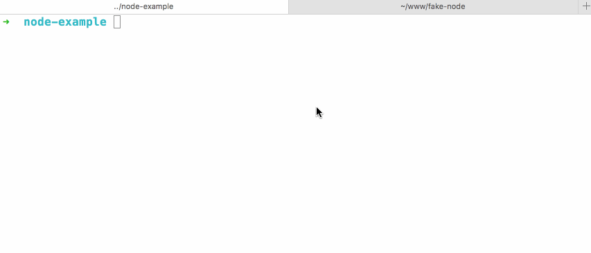

# 主题
本项目研究如何将 [V8引擎](https://github.com/v8/v8) 嵌入到 C++ 应用中，以此学习 Node 实现的基本原理。
在运行此项目之前，需满足以下条件：

1. 有一定的 C++ 基础
2. 阅读官方手册，关于[如何内嵌 V8 的说明](https://github.com/v8/v8/wiki/Getting-Started-with-Embedding)

# 说明
1. 由于此项目依赖于 V8，我已经提前将 V8 编译好，存放到目录 out 中。直接执行 ./out/x64.release/d8 就可以运行 V8 的 debug 实例：d8。
如下图所示

2. 编译的 V8 版本为 4.8，所以，本例使用的 V8 也是 4.8 版本。
3. include 文件夹是从 V8 源码中拷贝过来的头文件

# 运行

1. 执行命令`clang++ -stdlib=libstdc++ -std=c++11 -I. hello_world.cpp -o hello_world out/x64.release/libv8_base.a out/x64.release/libv8_libbase.a out/x64.release/libicudata.a out/x64.release/libicuuc.a out/x64.release/libicui18n.a out/x64.release/libv8_base.a out/x64.release/libv8_external_snapshot.a out/x64.release/libv8_libplatform.a`，便可编译生成官方的 demo，
输入 `./hello_world` 执行该 demo，即可查看到输出字符串 "youngwind"。
2. 同理，执行命令`clang++ -stdlib=libstdc++ -std=c++11 -I. main.cpp -o main out/x64.release/libv8_base.a out/x64.release/libv8_libbase.a out/x64.release/libicudata.a out/x64.release/libicuuc.a out/x64.release/libicui18n.a out/x64.release/libv8_external_snapshot.a out/x64.release/libv8_libplatform.a`，
生成本项目的可执行文件，输入`./main`执行。

# main 有什么功能？

## 全局注入 console 函数
main 参考自 V8 源码中的 /sample/shell.cc，最大程度地删减了非必要的代码而成。
目前 main.cpp 只完成一个功能："全局注入 console 函数，使得 JS 具有全局 console 方法；当 JS 调用 console 方法的时候，打印其传递的参数"。
正是通过这一形式，使得 JS 具备调用 C++ 的能力，这也是 Node 得以实现的基础。
下图是 d8 与 main 的对比。

## 全局注入 newHttp 函数
调用 newHttp 函数，可以发起一个 http 请求。调用方式如下： `newHttp('localhost', 4444);` 
第一个参数是域名，第二个参数是端口号，目前只支持这种最简单的请求。
你需要先在本地起一个 http 服务器，端口号是 4444。（比如我用 express 起的服务器）
如下图所示：

